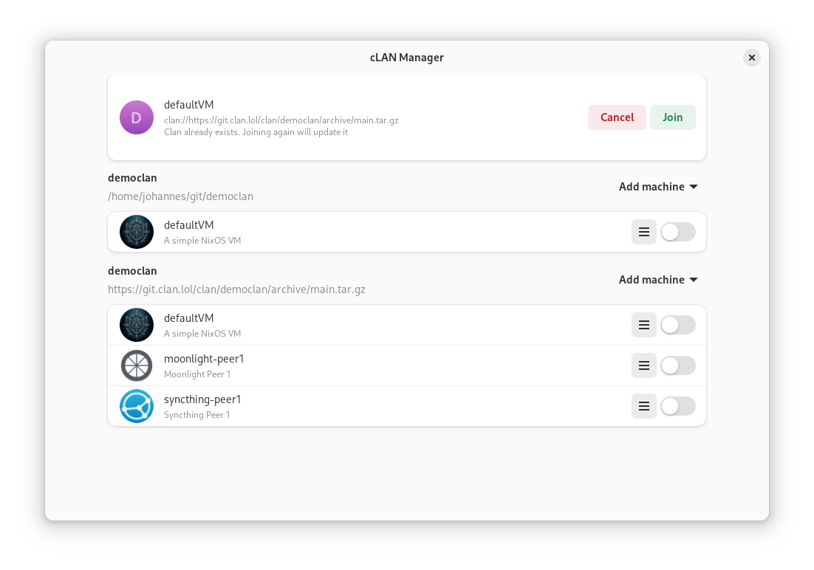

# Clan VM Manager

Provides users with the simple functionality to manage their locally registered clans.



## Available commands

Run this application

```bash
./bin/clan-vm-manager
```

Join a new clan

```bash
./bin/clan-vm-manager [clan-uri]
```

For more available commands see the developer section below.

## Developing this Application

### Debugging Style and Layout

```bash
# Enable the GTK debugger
gsettings set org.gtk.Settings.Debug enable-inspector-keybinding true

# Start the application with the debugger attached
GTK_DEBUG=interactive ./bin/clan-vm-manager --debug
```

Appending `--debug` flag enables debug logging printed into the console.

### Profiling

To activate profiling you can run

```bash
PERF=1 ./bin/clan-vm-manager
```

### Library Components

> Note:
>
> we recognized bugs when starting some cli-commands through the integrated vs-code terminal.
> If encountering issues make sure to run commands in a regular os-shell.

lib-Adw has a demo application showing all widgets. You can run it by executing

```bash
adwaita-1-demo
```

GTK4 has a demo application showing all widgets. You can run it by executing

```bash
gtk4-widget-factory
```

To find available icons execute

```bash
gtk4-icon-browser
```

### Links

Here are some important documentation links related to the Clan VM Manager:

- [Adw PyGobject Reference](http://lazka.github.io/pgi-docs/index.html#Adw-1): This link provides the PyGObject reference documentation for the Adw library, which is used in the Clan VM Manager. It contains detailed information about the Adw widgets and their usage.

- [GTK4 PyGobject Reference](http://lazka.github.io/pgi-docs/index.html#Gtk-4.0): This link provides the PyGObject reference documentation for GTK4, the toolkit used for building the user interface of the Clan VM Manager. It includes information about GTK4 widgets, signals, and other features.

- [Adw Widget Gallery](https://gnome.pages.gitlab.gnome.org/libadwaita/doc/main/widget-gallery.html): This link showcases a widget gallery for Adw, allowing you to see the available widgets and their visual appearance. It can be helpful for designing the user interface of the Clan VM Manager.

- [Python + GTK3 Tutorial](https://python-gtk-3-tutorial.readthedocs.io/en/latest/textview.html): Although the Clan VM Manager uses GTK4, this tutorial for GTK3 can still be useful as it covers the basics of building GTK-based applications with Python. It includes examples and explanations for various GTK widgets, including text views.

- [GNOME Human Interface Guidelines](https://developer.gnome.org/hig/): This link provides the GNOME Human Interface Guidelines, which offer design and usability recommendations for creating GNOME applications. It covers topics such as layout, navigation, and interaction patterns.
